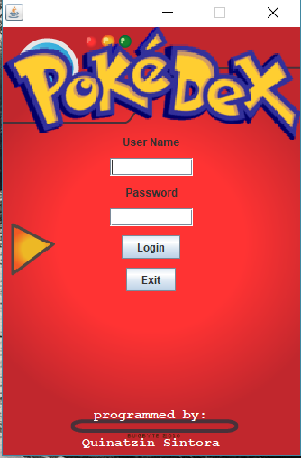
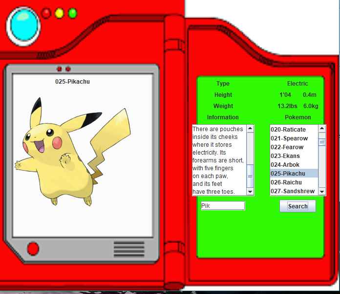

# PokemonTest
  Pokedex
  
# Things used in project
1.  IDE used for this project was Java Eclipse EE version Mars.2(4.5.2)
2.  JPanel, JLabel, JButtons, JTextFields, Arrray Strings for search, ImageIcon arrayList
3.  GridBagConstraints for layout and ActionPerformed for button clicked and searches.
4.  Background class for Logo image and background Image
5.  Background2 class for background of pokedex
6.  PokemonTest class is the main 
# Description
  This application has an login Interface when opened then has the search interface where 
  ones able to search for pokemons.  Search can be done by ether entering a number from 1 to 150 
  and clicking the search button or by entering the name of the pokemon.  This displays some of the 
  information of the pokemon on the right side of the screen with the type and number.
  I do not own the images in this application I only used them for testing and working with java
  code for this project.
  
# Screenshot
 
 
